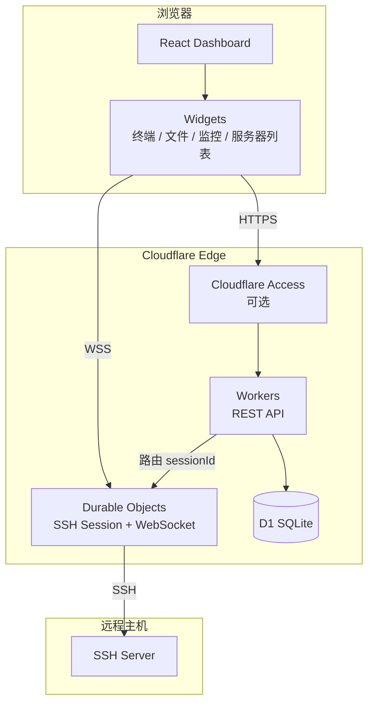

## 系统架构

```mermaid
flowchart TB
    subgraph Client["浏览器"]
        UI[React Dashboard]
        Widgets[Widgets<br/>终端 / 文件 / 监控 / 服务器列表]
        UI --> Widgets
    end

    subgraph Edge["Cloudflare Edge"]
        Access[Cloudflare Access<br/>可选]
        Worker[Workers<br/>REST API]
        DO[Durable Objects<br/>SSH Session + WebSocket]
        D1[(D1 SQLite)]
    end

    subgraph Remote["远程主机"]
        SSH[SSH Server]
    end

    Widgets -->|HTTPS| Access
    Access --> Worker
    Widgets -->|WSS| DO
    Worker --> D1
    Worker -->|路由 sessionId| DO
    DO -->|SSH| SSH
```
